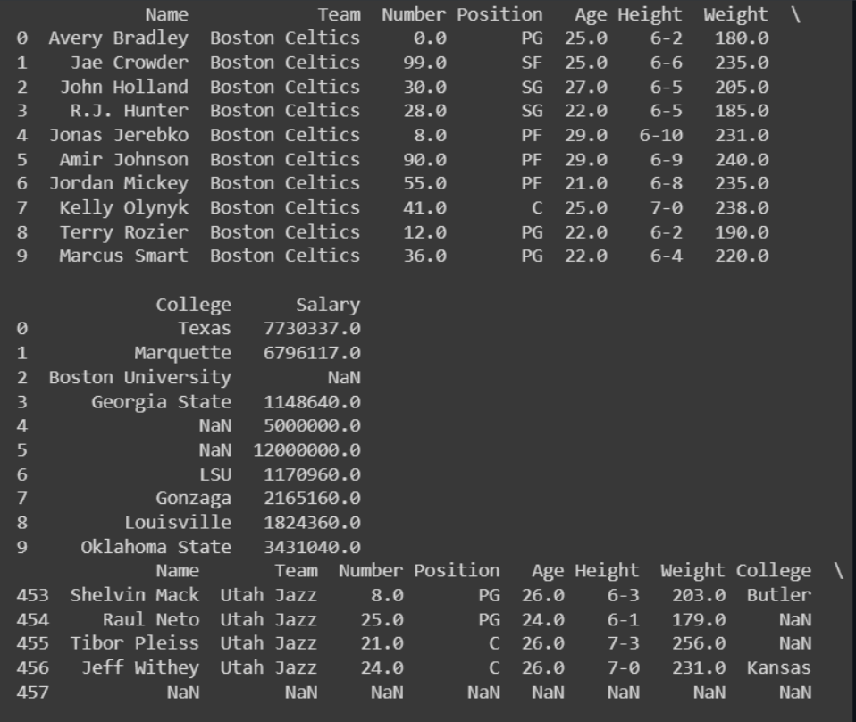

# Read-from-CSV

## AIM:

## ALGORITHM:
### Step 1:
Import pandas module as pd.

### Step 2:
Using pd.read_csv() method read the CSV file.

### Step 3:
Using df.head() print the first 10 rows of the CSV file.

### Step 4:
Using df.tail() print the last 5 of the CSV file.

### Step 5:
Using len(df.axes[]) print the toal no.of rows and columns with argument 0 for row and argument 1 for column. PROGRAM:

## PROGRAM:
```py
#Program to read contents from a CSV file
#Developed by: MOHAMMAD FAIZAL SK
#RegisterNumber: 212223240092
import pandas as pd
f=pd.read_csv('nba.csv')
print(f.head(10))
print(f.tail())
print('Number of Rows:',len(f.axes[0]))
print('Number of column:',len(f.axex[1]))
```

## OUTPUT:



## RESULT:
Hence the program is executed successfully.